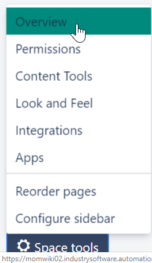
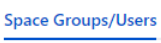
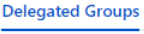
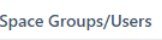
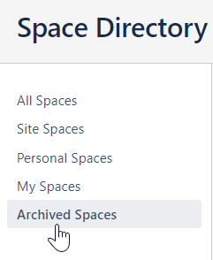
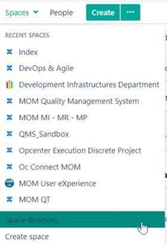
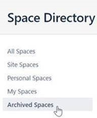



**Evaluation Only. Created with Aspose.Words. Copyright 2003-2022 Aspose Pty Ltd.**
# **How Space Administrators can manage their own spaces**
Attention

These instructions are directed at Space Administrators *only*.

For more information on Spaces and Reference Space Administrators, see the following:

|**Instance**|**Refer to**|
| :-: | :-: |
|**MOM Wiki** (momwiki02)|[MOM Confluence Spaces - Overview](file:///C:/display/alm/MOM+Confluence+Spaces+-+Overview)|
|**MOM WikiDOC** (momwiki01)|[MOM Documentation Wiki Home](https://momwiki01.industrysoftware.automation.siemens.com/display/INDEX/MOM+Documentation+Wiki+Home)|
- [How to manage user groups accessing a space](#HowSpaceAdministratorscanmanagetheirownspaces-Howtomanageusergroupsaccessingaspace) 
  - [Authorization via the Space key](#HowSpaceAdministratorscanmanagetheirownspaces-SpacekeyAuthorizationviatheSpacekey) 
    - [Prerequisites to manage user groups](#HowSpaceAdministratorscanmanagetheirownspaces-Prerequisites_spacekeyPrerequisitestomanageusergroups)
    - [How to manage user groups](#HowSpaceAdministratorscanmanagetheirownspaces-Howtomanageusergroups)
    - [A special case](#HowSpaceAdministratorscanmanagetheirownspaces-SpecialAspecialcase)
  - [Authorization via Delegated groups](#HowSpaceAdministratorscanmanagetheirownspaces-DelegatedgroupsAuthorizationviaDelegatedgroups) 
    - [Prerequisites to manage user groups](#HowSpaceAdministratorscanmanagetheirownspaces-Prerequisites_delegatedgroupsPrerequisitestomanageusergroups)
    - [How to manage user groups](#HowSpaceAdministratorscanmanagetheirownspaces-Howtomanageusergroups.1)
- [How to archive a space](#HowSpaceAdministratorscanmanagetheirownspaces-Howtoarchiveaspace)
- [How to access an archived space](#HowSpaceAdministratorscanmanagetheirownspaces-Howtoaccessanarchivedspace)
## **How to manage user groups accessing a space**
[Custom Space User Management (CSUM)](https://marketplace.atlassian.com/apps/133/custom-space-user-management-csum) is a plugin that allows Space Administrators to manage the user groups accessing their own spaces.

Two different methods to manage user groups are available:

- [Authorization via the Space key](#HowSpaceAdministratorscanmanagetheirownspaces-Spacekey)
- [Authorization via Delegated groups](#HowSpaceAdministratorscanmanagetheirownspaces-Delegatedgroups)[ ](#HowSpaceAdministratorscanmanagetheirownspaces-Delegatedgroups)
### **Authorization via the Space key**
This method is used in **MOM Wiki**: <https://momwiki02.industrysoftware.automation.siemens.com/>

Assigning a Confluence license in MOM Wiki

A Confluence license is *automatically* assigned to new users without it, when Space Administrators add them (via the [Custom Space User Management (CSUM)](https://marketplace.atlassian.com/apps/133/custom-space-user-management-csum) plugin) to the user groups accessing their space(s).
#### **Prerequisites to manage user groups**
\1. Users must have an [SWQA account](https://momwiki02.industrysoftware.automation.siemens.com/display/DID/SWQA+Account) and a Confluence license

\2. The name of the user groups accessing a space must comply with the following standards:

- Have “*spacekey-“* as a prefix

Note

A unique space key is associated with a new space when it is created. This space key cannot be changed later.

The CSUM plugin automatically adds the "*spacekey-*" prefix in lower format, when you create a new user group.

Therefore, you only need to type the second part of the user group name: see an example in the image below.

- Be written in *lowercase* and the words composing the name be separated by "-" (hyphen)

Example

The "Development Infrastructures Department" space has "DID" as a space key.

Therefore, **did-administrators**, **did-users**, **did-visitors** are group names that can be managed by Space Admins.

How to find the space key

On the bottom left-hand side of your space, select **Space tools** > **Overview**

The space key is displayed in the **Space Details** tab

#### **How to manage user groups**
\1. On the bottom left-hand side of your space, select **Space tools** > **Custom Space User Management**

\2. Provided that  the above [prerequisites](#HowSpaceAdministratorscanmanagetheirownspaces-Prerequisites_spacekey) are met, you can execute the following operations:

- Create a new user group
- Rename/Delete an existing user group
- Add/Remove one or more users to/from a group

\3. Click the tab.

For more information, please see <https://thepluginpeople.atlassian.net/wiki/spaces/CSUM/pages/159454839/How+to+use+CSUM>

Note

To bulk add/remove users, you must specify the [SWQA ]()usernames in a CSV file.
#### **A special case**
With the [Custom Space User Management (CSUM)](https://marketplace.atlassian.com/apps/133/custom-space-user-management-csum) plugin, Space Administrators can manage user groups that comply with the aforementioned [prerequisites](#HowSpaceAdministratorscanmanagetheirownspaces-Prerequisites) *only*.

Therefore, if user groups with names different from the standard access your space, you can manage their permissions (**Space tools** > **Permissions**), but *not* their members (**Space tools** > **Custom Space User Management**).

Example:

Space Admins can manage the access permisssions of four user groups: **momcc-readers**, **momcc-users**. **unity-users** and  **unity-visitors**.

Space Admins can manage the members of two user groups only: **momcc-readers** and **momcc-users**.
### **Authorization via Delegated groups**
This method is used in **MOM WikiDOC**: <https://momwiki01.industrysoftware.automation.siemens.com/>

Assigning a Confluence license in WikiDOC

A Confluence license is *automatically* assigned to new users without it, when Space Administrators add them (via the [Custom Space User Management (CSUM)](https://marketplace.atlassian.com/apps/133/custom-space-user-management-csum) plugin) to the user groups accessing their space(s).
#### **Prerequisites to manage user groups**
\1. Users must have an [SWQA account](https://momwiki02.industrysoftware.automation.siemens.com/display/DID/SWQA+Account) and a Confluence license

\2. Space Administrators must be authorized by Confluence system administrators to manage delegated user groups

\3. User groups must be created/deleted by Confluence system administrators: if required, please submit a [request](https://momwiki02.industrysoftware.automation.siemens.com/display/INDEX/MOM+Wiki+Home#MOMWikiHome-Ticket)
#### **How to manage user groups**
\1. On the bottom left-hand side of your space, select **Space tools** > **Custom Space User Management**

\2. Provided that the above [prerequisites ](#HowSpaceAdministratorscanmanagetheirownspaces-Prerequisites_delegatedgroups)are met, you can execute the following operations:

- Add one or more users to a delegated group
- Remove one or more users from a delegated group

\3. Click the tab.

For more information, please see:

- [Adding users to a delegated group](https://thepluginpeople.atlassian.net/wiki/spaces/CSUM/pages/1223196805/Delegated+Group+Management+and+Configuration#Adding-users-to-a-delegated-group)
- [Removing users from delegated groups](https://thepluginpeople.atlassian.net/wiki/spaces/CSUM/pages/1223196805/Delegated+Group+Management+and+Configuration#Removing-users-from-delegated-groups)

Note

The  tab must *not* be selected in WikiDOC (momwiki01).
## **How to archive a space**
If a space is no longer used, Space Admins must archive it:

\1. On the bottom left-hand side of your space, select **Space tools** > **Overview**

\2. In the **Space Details** tab, select **Edit Space Details**

\3. Select **Archived** from the **Status** drop-down list box

\4. Click **Save**

\5. Set read-only access permissions to the archived space

\6. Submit a [request](https://momwiki02.industrysoftware.automation.siemens.com/display/INDEX/MOM+Wiki+Home#MOMWikiHome-Ticket) to remove the archived space from the list of the current spaces in [MOM R&D Confluence Spaces - Overview]()

*Result*: the archived space is displayed in the **Archived Spaces** section of the **Space Directory**.

Note

This archiving procedure does *not* apply to End-User documentation spaces.
## **How to access an archived space**
\1. Log in to Confluence (with your SWQA credentials)

\2. On the top left-hand side of a space, select **Spaces > Space directory**

\3. From the left-hand side panel, select **Archived Spaces**

Tip

Archived spaces are listed in alphabetical order.
**Created with an evaluation copy of Aspose.Words. To discover the full versions of our APIs please visit: https://products.aspose.com/words/**
