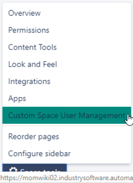

**Evaluation Only. Created with Aspose.Words. Copyright 2003-2022 Aspose Pty Ltd.**

**How Space Administrators can manage their own spaces**

 **Attention**

These instructions are directed at Space Administrators *only*.

For more information on Spaces and Reference Space Administrators, see the following:

**Instance Refer to**

**MOM Wiki** (momwiki02) MOM Confluence Spaces - Overview **MOM WikiDOC** (momwiki01) MOM Documentation Wiki Home

- How to manage user groups accessing a space
  - Authorization via the Space key
    - Prerequisites to manage user groups
      - How to manage user groups
        - A special case  Authorization via Delegated groups
          - Prerequisites to manage user groups
            - How to manage user groups
  - How to archive a space
    - How to access an archived space

How to manage user groups accessing a space

Custom Space User Management (CSUM) is a plugin that allows Space Administrators to manage the user groups accessing their own spaces. Two different methods to manage user groups are available:

 Authorization via the Space key  Authorization via Delegated groups 

**Authorization via the Space key**

This method is used in **MOM Wiki**: https://momwiki02.industrysoftware.automation.siemens.com/

 **Assigning a Confluence license in MOM Wiki**

A Confluence license is *automatically* assigned to new users without it, when Space Administrators add them (via the Custom Space User Management (CSUM) plugin) to the user groups accessing their space(s).

**Prerequisites to manage user groups**

1. Users must have an SWQA account and a Confluence license
1. The name of the user groups accessing a space must comply with the following standards:

 Have “*spacekey-“* as a prefix

 **Note**

A unique space key is associated with a new space when it is created. This space key cannot be changed later.

The CSUM plugin automatically adds the "*spacekey-*" prefix in lower format, when you create a new user group. Therefore, you only need to type the second part of the user group name: see an example in the image below.

 Be written in *lowercase* and the words composing the name be separated by "-" (hyphen)

 **Example**

The "Development Infrastructures Department" space has "DID" as a space key.

Therefore, **did-administrators**, **did-users**, **did-visitors** are group names that can be managed by Space Admins.

How to find the space key

On the bottom left-hand side of your space, select **Space tools** > **Overview**

The space key is displayed in the **Space Details** tab

**How to manage user groups**

1. On the bottom left-hand side of your space, select **Space tools** > **Custom Space User Management**

2. Provided that  the above prerequisites are met, you can execute the following operations:

 Create a new user group

- Rename/Delete an existing user group
  - Add/Remove one or more users to/from a group
3. Click the tab.

For more information, please see https://thepluginpeople.atlassian.net/wiki/spaces/CSUM/pages/159454839/How+to+use+CSUM

 **Note**

To bulk add/remove users, you must specify the SWQA usernames in a CSV file.

**A special case**

With the Custom Space User Management (CSUM) plugin, Space Administrators can manage user groups that comply with the aforementioned prerequisit es *only*.

Therefore, if user groups with names different from the standard access your space, you can manage their permissions (**Space tools** > **Permissions**), but *not* their members (**Space tools** > **Custom Space User Management**).

Example:

Space Admins can manage the access permisssions of four user groups: **momcc-readers**, **momcc-users**. **unity-users** and  **unity-visitors**.

Space Admins can manage the members of two user groups only: **momcc-readers** and **momcc-users**.

**Authorization via Delegated groups**

This method is used in **MOM WikiDOC**: https://momwiki01.industrysoftware.automation.siemens.com/

 **Assigning a Confluence license in WikiDOC**

A Confluence license is *automatically* assigned to new users without it, when Space Administrators add them (via the Custom Space User Management (CSUM) plugin) to the user groups accessing their space(s).

**Prerequisites to manage user groups**

1. Users must have an SWQA account and a Confluence license
1. Space Administrators must be authorized by Confluence system administrators to manage delegated user groups
1. User groups must be created/deleted by Confluence system administrators: if required, please submit a request

**How to manage user groups**

1. On the bottom left-hand side of your space, select **Space tools** > **Custom Space User Management**

2. Provided that the above prerequisites are met, you can execute the following operations:
- Add one or more users to a delegated group
  - Remove one or more users from a delegated group
3. Click the tab. For more information, please see:
- Adding users to a delegated group
  - Removing users from delegated groups

 **Note**

The  tab must *not* be selected in WikiDOC (momwiki01).

How to archive a space

If a space is no longer used, Space Admins must archive it:

1. On the bottom left-hand side of your space, select **Space tools** > **Overview**
1. In the **Space Details** tab, select **Edit Space Details**

3. Select **Archived** from the **Status** drop-down list box

4. Click **Save**
4. Set read-only access permissions to the archived space
4. Submit a request to remove the archived space from the list of the current spaces in MOM R&D Confluence Spaces - Overview *Result*: the archived space is displayed in the **Archived Spaces** section of the **Space Directory**.

 **Note**

This archiving procedure does *not* apply to End-User documentation spaces.

How to access an archived space

1. Log in to Confluence (with your SWQA credentials)
1. On the top left-hand side of a space, select **Spaces > Space directory**

3. From the left-hand side panel, select **Archived Spaces**

 **Tip**

Archived spaces are listed in alphabetical order.
**Created with an evaluation copy of Aspose.Words. To discover the full versions of our APIs please visit: https://products.aspose.com/words/**
